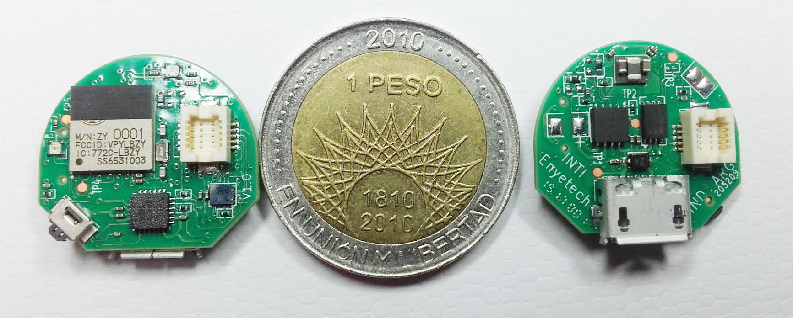

# KiCad CI/CD test using Spora

This project is a demo of [CI/CD](https://en.wikipedia.org/wiki/Continuous_integration) for [KiCad](https://www.kicad.org/)

## Objetive

Automate the following tasks:
* ERC and DRC checks
* PDF versions of the schematic and PCB for documentation
* Generation of fabrication files (BoMs, gerbers, drill, position, 3D model, etc.)

## Tools used

To automate the process here we use:
* [KiBot](https://github.com/INTI-CMNB/KiBot) to generate gerbers, drill, position files and BoMs (HTML, XLSX and CSV)
* [kicad-automation-scripts](https://github.com/INTI-CMNB/kicad-automation-scripts) to run DRC/ERC, print schematics and PCB
* [InteractiveHtmlBom](https://github.com/INTI-CMNB/InteractiveHtmlBom) to generate interactive HTML BoMs
* [PcbDraw](https://github.com/INTI-CMNB/PcbDraw) to generate the PCB previews using different colors
* Docker to integrate KiCad and all the tools in a single package suitable for CI/CD pipelines
* GitHub CI/CD pipeline mechanism

The docker image can be found [here](https://github.com/INTI-CMNB/kicad_auto)

## Test project

As a testbed we are using the [Spora](https://github.com/INTI-CMNB/spora) project. It contains three separated boards:
* **pcb_io** is the I/O module. 2 layers
* **pcb_main** is the main module. 6 layers.
* **pcb_prog** is the programmer interface. 2 layers.

## Here is what we test

The pipeline we test here runs 3 workflows, one for each PCB. Each workflow runs 4 jobs:

- ERC: Runs the Electrical Rules Check (schematic test).
- Schematic fabrication files: Generates all the outputs related to the schematic. Runs only if the ERC was successful.
- DRC: Runs the Design Rules Check (PCB test). Runs only if the ERC was successful.
- PCB fabrication files: Generates all the outputs related to the PCB. Runs only if the DRC was successful.

When a commit affects any of the schematics, PCBs or the associated Makefiles the workflow is started.

The configuration for the workflows can be found here: [.github/workflows/](https://github.com/INTI-CMNB/kicad-ci-test-spora/tree/master/.github/workflows)

To get the generated outputs you must enter in one of the workflows, [here is an example](https://github.com/INTI-CMNB/kicad-ci-test-spora/actions/runs/562325892).
Use the `Actions` option at the top of the page.

## Here is what we get

The summary of each workflow contains the generated files in a compressed ZIP. In the GitHub dialect these are the *artifacts*.
Here are links to the run #5 (2021-02-12):

- Main board:
  - [ERC report](https://github.com/INTI-CMNB/kicad-ci-test-spora/suites/2030327470/artifacts/40807405)
  - [DRC report](https://github.com/INTI-CMNB/kicad-ci-test-spora/suites/2030327470/artifacts/40807404)
  - [Schematic related stuff](https://github.com/INTI-CMNB/kicad-ci-test-spora/suites/2030327470/artifacts/40807407)
  - [PCB related stuff](https://github.com/INTI-CMNB/kicad-ci-test-spora/suites/2030327470/artifacts/40807406)
- I/O board:
  - [ERC report](https://github.com/INTI-CMNB/kicad-ci-test-spora/suites/2030327468/artifacts/40799887)
  - [DRC report](https://github.com/INTI-CMNB/kicad-ci-test-spora/suites/2030327468/artifacts/40799886)
  - [Schematic related stuff](https://github.com/INTI-CMNB/kicad-ci-test-spora/suites/2030327468/artifacts/40799889)
  - [PCB related stuff](https://github.com/INTI-CMNB/kicad-ci-test-spora/suites/2030327468/artifacts/40799888)
- Programmer board:
  - [ERC report](https://github.com/INTI-CMNB/kicad-ci-test-spora/suites/2030327465/artifacts/40799892)
  - [DRC report](https://github.com/INTI-CMNB/kicad-ci-test-spora/suites/2030327465/artifacts/40799891)
  - [Schematic related stuff](https://github.com/INTI-CMNB/kicad-ci-test-spora/suites/2030327465/artifacts/40799894)
  - [PCB related stuff](https://github.com/INTI-CMNB/kicad-ci-test-spora/suites/2030327465/artifacts/40799893)

## The KiBot configuration

The KiBot configuration files are:

- [Main board](https://github.com/INTI-CMNB/kicad-ci-test-spora/blob/master/pcb_main/spora.kibot.yaml)
- [I/O board](https://github.com/INTI-CMNB/kicad-ci-test-spora/blob/master/pcb_io/spora_io.kibot.yaml)
- [Programmer board](https://github.com/INTI-CMNB/kicad-ci-test-spora/blob/master/pcb_io/spora_io.kibot.yaml)

We also generate gerbers and drill files for some common manufacturers using the configurations found [here](https://github.com/INTI-CMNB/kicad-ci-test-spora/tree/master/configs)

## Original Spora README

BUILD AWESOME WEARABLES

Open hardware platform for wearables.

Lots of sensors ready to use, program and expand at ease. All packed in an incredible small size.
More info at [Spora web page](https://sporaio.com/).

Final release in [Spora repo](https://github.com/sporaio)

